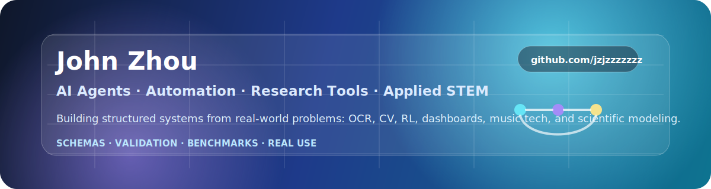

<h1 align="center">Hi, I'm John Zhou 👋</h1>

<p align="center">
  <b>Project-based STEM builder</b><br/>
  AI Agents · Automation · Research Tools · Computer Vision · Scientific Modeling
</p>

<p align="center">
  <a href="https://github.com/jzjzzzzzzz">
    
  </a>
  <a href="https://github.com/jzjzzzzzzz?tab=followers">
    
  </a>
  <a href="https://github.com/jzjzzzzzzz?tab=repositories">
    
  </a>
</p>

<p align="center">
  
</p>

---

## About Me

I am a student at **Princeton International School of Mathematics and Science**.  
I build tools that turn messy real-world problems into structured systems: schemas, validators, simulations, automations, dashboards, and useful software.

My main interests are:

- **AI agents** that can understand one domain deeply instead of only chatting
- **Safe automation** with OCR checks, dry runs, status indicators, and audit logs
- **Computer vision** for screen recognition and decision support
- **Research software** for biology, environmental data, simulation, and modeling
- **Music technology** for sheet-music conversion, transposition, and workflow automation
- **Game / CLI tools** that turn algorithms into interactive systems

---

## Project Map

### AI Agents & Automation

- [**wechat-assistant**](https://github.com/jzjzzzzzzz/wechat-assistant) - A macOS Python assistant for safe WeChat UI automation with OCR contact checks, dry-run scheduling, birthday reminders, templates, audit logs, and a Tkinter dashboard. | `Python` `macOS` `OCR` `Tkinter` `Automation`
- [**wechat-ai-bot**](https://github.com/jzjzzzzzzz/wechat-ai-bot) - A FastAPI backend prototype for WeChat and Enterprise WeChat bot callbacks, local chat testing, URL verification, and encrypted message helpers. | `Python` `FastAPI` `Webhook` `Chatbot`
- [**internet-meme-radar-skill**](https://github.com/jzjzzzzzzz/internet-meme-radar-skill) - A Codex skill for researching internet memes, slang, viral jokes, short-video trends, and platform-specific cultural references with evidence-based uncertainty. | `Python` `Research` `Skill` `Internet Culture`

### Computer Vision & Decision Support

- [**quehun**](https://github.com/jzjzzzzzzz/quehun) - A Mahjong Soul screen-recognition assistant for tile detection, hand-efficiency analysis, and optional guarded auto-clicking on Windows and macOS. | `Python` `OpenCV` `Computer Vision` `Automation`

### Research, Modeling & Sustainability

- [**algae-project**](https://github.com/jzjzzzzzzz/algae-project) - A Python research sandbox for simulating algae growth and training a PPO reinforcement-learning controller over light, nutrients, temperature, ultrasound, and trace elements. | `Python` `RL` `Simulation` `Algae`
- [**base-algae**](https://github.com/jzjzzzzzzz/base-algae) - A Python research workspace for algae sound-frequency experiments, browser-based tone exposure automation, session logging, and turbidity/lux plotting. | `Python` `Research` `Selenium` `Matplotlib`
- [**Algae-Growth-RL-learning**](https://github.com/jzjzzzzzzz/Algae-Growth-RL-learning) - A reinforcement-learning project for simulating algae growth and optimizing environmental factors such as light, nutrients, ultrasound, and trace elements. | `Python` `Machine Learning` `Optimization`
- [**nj-nitrate-dashboard**](https://github.com/jzjzzzzzzz/nj-nitrate-dashboard) - A read-only Flask dashboard for precomputed New Jersey nitrate research outputs, including maps, figures, dashboard JSON, and proposal assets. | `HTML` `Flask` `Water Quality` `Dashboard`

### Music Technology

- [**PDFtoMSCZ**](https://github.com/jzjzzzzzzz/PDFtoMSCZ) - A Python workflow that converts PDF sheet music to editable MuseScore MSCZ files using Audiveris OMR and MuseScore 4. | `Python` `OMR` `MuseScore` `Sheet Music`
- [**Auto-Music-Transpose**](https://github.com/jzjzzzzzzz/Auto-Music-Transpose) - A Python tool for transposing MuseScore MSCZ files while preserving rhythm, rests, chords, note spelling, key signatures, and optional PDF export. | `Python` `MusicXML` `Music Theory`
- [**auto-transpose**](https://github.com/jzjzzzzzzz/auto-transpose) - A Python toolkit for MuseScore, SmartScore, MusicXML, PDF, and MSCZ conversion and transposition workflows. | `Python` `MusicXML` `PDF Conversion`

### Tools, Games & Learning Projects

- [**code-buster**](https://github.com/jzjzzzzzzz/code-buster) - A command-line decoder for Codebusters-style ciphers, including Caesar, affine, Atbash, Vigenere, Morse, Baconian, and substitution search. | `Python` `CLI` `Ciphers`
- [**fcsgame**](https://github.com/jzjzzzzzzz/fcsgame) - A console-based Python farming, crafting, and survival game prototype with world generation, inventory, exploration, and text-file save data. | `Python` `CLI Game` `World Generation`
- [**ai-book-video-project**](https://github.com/jzjzzzzzzz/ai-book-video-project) - A Chinese short-video generator for AI web-novel promotion clips, with 9:16 storyboards, narration, subtitles, background audio, and fallback rendering. | `Python` `FFmpeg` `Pillow` `Subtitles`

---

## Current Focus

```text
Natural language prompt
        ↓
Structured intent schema
        ↓
Validation rules
        ↓
Generated artifact
        ↓
Tests, benchmarks, and real use
```

I am especially interested in **domain-specific agents**: tools that can reject bad prompts, ask for missing constraints, produce structured outputs, and verify their own results.

---

## Toolbox

<p align="center">
  
</p>

**Languages**  
Python · Java · C++ · JavaScript · HTML/CSS

**AI / Automation**  
OCR · Selenium · FastAPI · Tkinter · OpenCV · agent tooling · workflow design

**Research / Modeling**  
Simulation · reinforcement learning · data visualization · scientific measurement · validation rules

**Engineering Habits**  
Clear schemas · safe defaults · reproducible examples · readable docs · testing and benchmarks

---

## GitHub Statistics

<p align="center">
  
  
</p>

<p align="center">
  
</p>

---

## Contribution Activity

<p align="center">
  
</p>

<p align="center">
  <picture>
    <source media="(prefers-color-scheme: dark)" srcset="https://raw.githubusercontent.com/jzjzzzzzzz/jzjzzzzzzz/output/github-contribution-grid-snake-dark.svg" />
    <source media="(prefers-color-scheme: light)" srcset="https://raw.githubusercontent.com/jzjzzzzzzz/jzjzzzzzzz/output/github-contribution-grid-snake.svg" />
    
  </picture>
</p>

---

## How I Build

> Start from a real problem.  
> Turn it into a structured model.  
> Build the smallest useful system.  
> Measure where it fails.  
> Add validation, safety, and feedback loops.  
> Repeat until the tool becomes actually useful.

---

## Contact

The best way to reach me is through GitHub issues or discussions on one of my project repositories.
