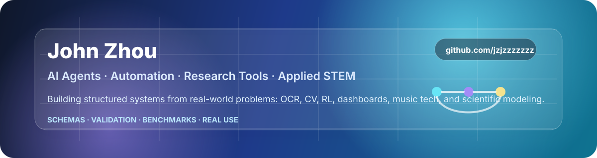

<h1 align="center">Hi, I'm John Zhou 👋</h1>

<p align="center">
  <b>Project-based STEM builder</b><br/>
  AI Agents · Automation · Research Tools · Computer Vision · Scientific Modeling
</p>

<p align="center">
  <a href="https://github.com/jzjzzzzzzz">
    
  </a>
  <a href="https://github.com/jzjzzzzzzz?tab=followers">
    
  </a>
  <a href="https://github.com/jzjzzzzzzz?tab=repositories">
    
  </a>
</p>

<p align="center">
  
</p>

---

## Live Links

| Link | Description |
|------|-------------|
| [jz-ai-chat.com](https://jz-ai-chat.com) | Portfolio website — project showcase |
| [Dashboard](https://jz-ai-chat.com/dashboard/) | Real-time data dashboard (HN / GitHub / Crypto / RSS, 1s refresh) |

---

## About Me

I am a student at **Princeton International School of Mathematics and Science**.  
I build tools that turn messy real-world problems into structured systems: schemas, validators, simulations, automations, dashboards, and useful software.

My main interests are:

- **AI agents** that can understand one domain deeply instead of only chatting
- **Safe automation** with OCR checks, dry runs, status indicators, and audit logs
- **Computer vision** for screen recognition and decision support
- **Research software** for biology, environmental data, simulation, and modeling
- **Music technology** for sheet-music conversion, transposition, and workflow automation
- **Game / CLI tools** that turn algorithms into interactive systems

---

## Selected Projects

This profile highlights a small set of active, public repositories. The complete catalog remains available on the [Repositories](https://github.com/jzjzzzzzzz?tab=repositories) tab.

| Project | Focus | Stack |
|---|---|---|
| [**IntentForge**](https://github.com/jzjzzzzzzz/IntentForge) | Deterministic CAD generation with explicit intent schemas and validation. | `Python` `CadQuery` `MCP` |
| [**dot-studio**](https://github.com/jzjzzzzzzz/dot-studio) | Local-first console for composing and delivering content to connected displays. | `TypeScript` `Next.js` `Canvas` |
| [**pcr532-development-platform**](https://github.com/jzjzzzzzzz/pcr532-development-platform) | Browser-based NFC diagnostics, reading, and controlled card-writing workflows. | `TypeScript` `Web Serial` `NFC` |
| [**wechat-assistant**](https://github.com/jzjzzzzzzz/wechat-assistant) | Guarded macOS automation with OCR verification, dry runs, and audit logs. | `Python` `OCR` `Tkinter` |
| [**quehun**](https://github.com/jzjzzzzzzz/quehun) | Screen recognition and decision support for Mahjong hand analysis. | `Python` `OpenCV` `Computer Vision` |
| [**PlanetPulse**](https://github.com/jzjzzzzzzz/PlanetPulse) | Interactive environmental monitoring with live NASA data and explainable ranking. | `TypeScript` `Next.js` `Three.js` |
| [**algae-research-toolkit**](https://github.com/jzjzzzzzzz/algae-research-toolkit) | Consolidated algae simulation, PPO experiments, exposure logging, and analysis. | `Python` `Gymnasium` `Research` |
| [**music-score-toolkit**](https://github.com/jzjzzzzzzz/music-score-toolkit) | Testable MuseScore transposition and explicit score-conversion workflows. | `Python` `MSCZ` `MusicXML` |
| [**PDFtoMSCZ**](https://github.com/jzjzzzzzzz/PDFtoMSCZ) | PDF-to-editable-score workflow using Audiveris OMR and MuseScore 4. | `Python` `OMR` `MuseScore` |
| [**internet-meme-radar-skill**](https://github.com/jzjzzzzzzz/internet-meme-radar-skill) | Evidence-based research workflow for fast-moving internet culture. | `Python` `Research` `Codex` |

---

## Current Focus

```text
Natural language prompt
        ↓
Structured intent schema
        ↓
Validation rules
        ↓
Generated artifact
        ↓
Tests, benchmarks, and real use
```

I am especially interested in **domain-specific agents**: tools that can reject bad prompts, ask for missing constraints, produce structured outputs, and verify their own results.

---

## Toolbox

<p align="center">
  
</p>

**Languages**  
Python · Java · C++ · JavaScript · HTML/CSS

**AI / Automation**  
OCR · Selenium · FastAPI · Tkinter · OpenCV · agent tooling · workflow design

**Research / Modeling**  
Simulation · reinforcement learning · data visualization · scientific measurement · validation rules

**Engineering Habits**  
Clear schemas · safe defaults · reproducible examples · readable docs · testing and benchmarks

---

## GitHub Statistics

<p align="center">
  
</p>

<p align="center">
  
  
</p>

<p align="center">
  
  
</p>

---
## Contribution Activity

<p align="center">
  
</p>
---

## Contribution Snake

<p align="center">
  <picture>
    <source
      media="(prefers-color-scheme: dark)"
      srcset="https://raw.githubusercontent.com/jzjzzzzzzz/jzjzzzzzzz/output/github-contribution-grid-snake-dark.svg"
    />
    <source
      media="(prefers-color-scheme: light)"
      srcset="https://raw.githubusercontent.com/jzjzzzzzzz/jzjzzzzzzz/output/github-contribution-grid-snake.svg"
    />
    
  </picture>
</p>

## How I Build

> Start from a real problem.  
> Turn it into a structured model.  
> Build the smallest useful system.  
> Measure where it fails.  
> Add validation, safety, and feedback loops.  
> Repeat until the tool becomes actually useful.

---

## Contact

- Website: [jz-ai-chat.com](https://jz-ai-chat.com)
- Email: [johnzhou811@gmail.com](mailto:johnzhou811@gmail.com)
- GitHub: [@jzjzzzzzzz](https://github.com/jzjzzzzzzz)
- Ethereum support address: `0x3bfF60b4e21DBC63a2B83d82DFEA2fCB645fBAB3`
- Phone: `13046621885` or `6092352723`
- WeChat: `Johnzhou2010`
